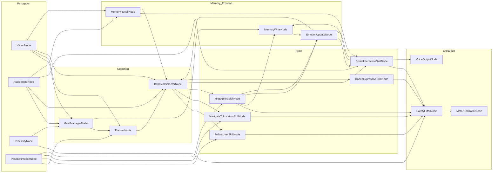

## 1. High-Level Graph Diagram (Mermaid)

You can paste this into a Mermaid editor to visualize:

---

## 2. Node-by-Node Breakdown (with Edges)

I’ll give each node an **ID**, what it does, and its **main edges / conditions**.

### 🧿 Perception Layer

---

**P1 – VisionNode**

* **Reads:** camera frames, `BrainState.world_model.self_pose`
* **Writes:** `sensors.vision`, `world_model.objects`, `world_model.humans`
* **Outgoing edges:**

  * → `C1 GoalManagerNode`

    * when new humans/objects are detected (may create/update goals)
  * → `C2 PlannerNode`

    * when environment changed in a way that affects plans (obstacle moved, new landmark)
  * → `C3 BehaviorSelectorNode`

    * when visual context changes behavior (e.g., someone waving)

---

**P2 – AudioIntentNode**

* **Reads:** mic audio
* **Writes:** `interaction.last_user_utterance`, `interaction.user_intent`, `interaction.user_id`
* **Outgoing edges:**

  * → `C1 GoalManagerNode`

    * on parsed intents: “follow me”, “come here”, “go to the door”, “stop”
  * → `C3 BehaviorSelectorNode`

    * for immediate reactions (e.g., jokes, quick acknowledgements)
  * → `S4 SocialInteractionSkillNode`

    * when input is clearly conversational (“How are you?”)

---

**P3 – ProximityNode**

* **Reads:** proximity sensors, cliff sensors, bump sensors
* **Writes:** `sensors.proximity`, updates `world_model.map` around robot
* **Outgoing edges:**

  * → `E1 SafetyFilterNode`

    * continuous, for collision avoidance
  * → `C1 GoalManagerNode`

    * when environment becomes blocked, may need new goals (reroute, stop, etc.)

---

**P4 – PoseEstimationNode**

* **Reads:** wheel odometry, IMU
* **Writes:** `world_model.self_pose`
* **Outgoing edges:**

  * → `C2 PlannerNode`

    * when pose diverges significantly from expected path
  * → `S1 FollowUserSkillNode`, `S2 NavigateToLocationSkillNode`, `S3 IdleExploreSkillNode`

    * skills need up-to-date pose for movement

---

### 🧠 Cognition Layer

---

**C1 – GoalManagerNode**

* **Reads:**

  * `interaction.user_intent`
  * `sensors` (battery, proximity)
  * `world_model`
  * `emotion`
* **Writes:** `goals` (list with priorities, statuses), `mode`
* **Outgoing edges:**

  * → `C2 PlannerNode`

    * when new goal created, or old goal canceled/completed
  * → `M1 MemoryWriteNode`

    * when significant goal state changes (new goal, goal finished/fails)

---

**C2 – PlannerNode**

* **Reads:** `goals`, `world_model`, `mode`
* **Writes:** `current_plan.steps`, `current_plan.goal_id`, `current_plan.active_step`
* **Outgoing edges:**

  * → `C3 BehaviorSelectorNode`

    * on new/updated plan
  * (optionally) → `E1 SafetyFilterNode`

    * for route-level safety checks (e.g., disallow certain zones)

---

**C3 – BehaviorSelectorNode**

* **Reads:**

  * `mode` (idle/follow/explore/… )
  * `current_plan.active_step`
  * `emotion`
  * `interaction` context
* **Writes:** something like `actuator_commands.behavior` + parameters (e.g., `target_user_id`, `target_location`)
* **Outgoing edges:**

  * → `S1 FollowUserSkillNode`

    * if active step = `follow_user`
  * → `S2 NavigateToLocationSkillNode`

    * if active step = `go_to_location`
  * → `S3 IdleExploreSkillNode`

    * if no active goals and mode = `idle` or `explore`
  * → `S4 SocialInteractionSkillNode`

    * if active step = `social_interaction`
  * → `S5 DanceExpressiveSkillNode`

    * if step or emotion triggers expressive act (user request, celebration)
  * → `M2 MemoryRecallNode`

    * when it needs context-specific behavior (e.g., greeting known person)
  * ← `M3 EmotionUpdateNode` (influences selection via `emotion`, but that’s state-based, not a hard edge)

---

### 🛠️ Skill / Behavior Layer

---

**S1 – FollowUserSkillNode**

* **Reads:** `world_model.humans`, `world_model.self_pose`, `interaction.user_id` (target), proximity
* **Writes:** `actuator_commands.drive`
* **Outgoing edges:**

  * → `E1 SafetyFilterNode`

    * always before motor output

---

**S2 – NavigateToLocationSkillNode**

* **Reads:** `world_model.map`, `world_model.self_pose`, `current_plan.active_step` (target location)
* **Writes:** `actuator_commands.drive`, path progress (back to `current_plan`)
* **Outgoing edges:**

  * → `E1 SafetyFilterNode`

---

**S3 – IdleExploreSkillNode**

* **Reads:** `world_model.map`, `world_model.self_pose`, `emotion`
* **Writes:** `actuator_commands.drive`, sometimes `actuator_commands.head` (looking around)
* **Outgoing edges:**

  * → `E1 SafetyFilterNode`
  * → `M1 MemoryWriteNode`

    * when discovering new areas/objects
  * → `M3 EmotionUpdateNode`

    * environment & exploration affect mood

---

**S4 – SocialInteractionSkillNode**

* **Reads:**

  * `interaction.last_user_utterance`
  * `interaction.user_intent`
  * `interaction.conversation_context`
  * `emotion`
  * `memory` retrieved via `M2`
* **Writes:**

  * `actuator_commands.voice` (what to say)
  * `actuator_commands.arms` (gesture id)
  * `actuator_commands.head` (gaze, nods)
* **Outgoing edges:**

  * → `E2 VoiceOutputNode`
  * → `E1 SafetyFilterNode` (if movement/gestures affect balance, optional)
  * → `M1 MemoryWriteNode`

    * for important interactions
  * → `M3 EmotionUpdateNode`

    * conversations affect mood
  * → `M2 MemoryRecallNode` (loop)

    * to fetch contextual memories mid-dialogue

---

**S5 – DanceExpressiveSkillNode**

* **Reads:** `emotion`, special triggers from user or events
* **Writes:** `actuator_commands.arms`, `actuator_commands.drive`, `actuator_commands.head`
* **Outgoing edges:**

  * → `E1 SafetyFilterNode`

---

### ⚙️ Execution Layer

---

**E1 – SafetyFilterNode**

* **Reads:**

  * `actuator_commands` (drive/arms/head)
  * `sensors.proximity`
  * `battery`
  * `world_model` (hazard zones)
* **Writes:** sanitized `actuator_commands`, safety flags/errors to `logs`
* **Outgoing edges:**

  * → `E3 MotorControllerNode`

    * only when commands are safe
  * → `C1 GoalManagerNode`

    * if safety violations require changing goals (e.g., “path blocked, abort goal”)

---

**E2 – VoiceOutputNode**

* **Reads:** `actuator_commands.voice`
* **Writes:** audio output (via TTS), logs of spoken text
* **Outgoing edges:**

  * (optional) → `M1 MemoryWriteNode`

    * for key spoken events
  * (optional) → `M3 EmotionUpdateNode`

    * self-expression can affect mood, if you want that loop

---

**E3 – MotorControllerNode**

* **Reads:** `actuator_commands.drive`, `actuator_commands.arms`, `actuator_commands.head`
* **Writes:** hardware-level commands + status/telemetry to `logs`
* **Outgoing edges:**

  * → `P4 PoseEstimationNode`

    * closes the loop by updating pose from motion

---

### 🧠📚 Memory & Emotion Layer

---

**M1 – MemoryWriteNode**

* **Reads:** `goals`, `current_plan`, `interaction`, `world_model`, events from skills
* **Writes:** external memory store: `people`, `places`, `episodes`
* **Outgoing edges:**

  * → `M3 EmotionUpdateNode`

    * significant events change emotional state

---

**M2 – MemoryRecallNode**

* **Reads:** query context from `interaction` & `world_model`
* **Writes:** `interaction.contextual_memory` (e.g. past interactions, known preferences)
* **Outgoing edges:**

  * → `S4 SocialInteractionSkillNode`

    * for more personalized dialogue
  * → `C3 BehaviorSelectorNode`

    * for context-aware behavior decisions (e.g., “user likes playful mode”)

---

**M3 – EmotionUpdateNode**

* **Reads:**

  * recent events (from `logs`, `goals`, `skills`)
  * time since last interaction
  * results of `MemoryWriteNode`
* **Writes:** `emotion` (arousal, valence, traits)
* **Outgoing edges:**

  * (via state) influences:

    * `C3 BehaviorSelectorNode`
    * `S3 IdleExploreSkillNode`
    * `S4 SocialInteractionSkillNode`
    * `S5 DanceExpressiveSkillNode`

---

## 3. How This Maps to LangGraph Concepts

In LangGraph terms, you can think of:

* **Nodes** = these functional units (P1, C1, S1, etc.)
* **Edges** = the transitions listed above, often **conditional**, e.g.:

  * If `interaction.user_intent == "follow_me"` → from `AudioIntentNode` eventually into `FollowUserSkillNode`.
  * If `goals` empty → `BehaviorSelectorNode` chooses `IdleExploreSkillNode`.
  * If `SafetyFilterNode` sees unsafe → skip `MotorControllerNode` and adjust goals.

You can implement this as:

* A **main supervisor node** that decides which subset of nodes to run each tick (perception → cognition → skills → execution), or
* A more reactive event-driven graph where events (new audio, new vision, etc.) trigger relevant nodes directly.

---
