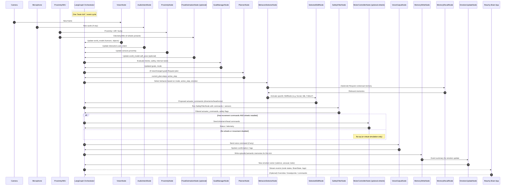
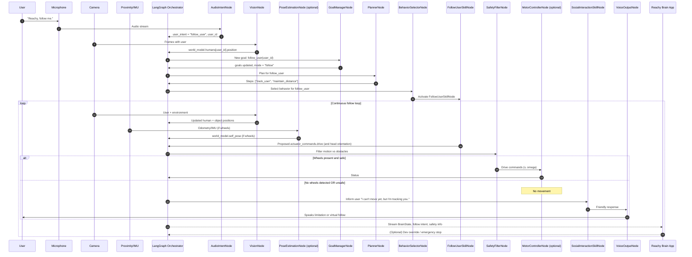
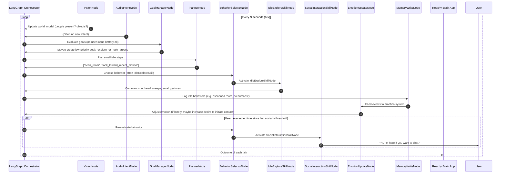

Here’s a first cut of the **runtime behavior sequence diagram** for Reachy Mini’s LangGraph brain, with **wheels optional** baked in.

I’ll show:

* Core **“Sense → Think → Act → Learn”** loop
* A **Greeting / Social interaction** flow (no wheels needed)
* A **Follow Me** flow that **only runs movement if wheels are present**

All diagrams are in Mermaid so you can paste them into any Mermaid viewer.

---

## 1. Core Life Loop (Tick-by-Tick Sequence)

This is the generic **brain tick**: perception → cognition → skill → execution → memory/emotion.



Key points:

* **PoseEstimationNode** and **MotorControllerNode** only matter when wheels exist.
* Without wheels, the loop still runs; **movement commands are ignored or simulated**.
* App always sees the same stream regardless of hardware.

---

## 2. Scenario: Greeting / Social Interaction (No Wheels Required)

This is a typical “Reachy is idle → user says hello → Reachy greets back with personality.”

```mermaid
sequenceDiagram
    autonumber
    participant User as User
    participant Mic as Microphone
    participant Cam as Camera
    participant LG as LangGraph Orchestrator
    participant V as VisionNode
    participant A as AudioIntentNode
    participant G as GoalManagerNode
    participant Plan as PlannerNode
    participant B as BehaviorSelectorNode
    participant MemR as MemoryRecallNode
    participant Social as SocialInteractionSkillNode
    participant Voice as VoiceOutputNode
    participant MemW as MemoryWriteNode
    participant Emo as EmotionUpdateNode
    participant App as Reachy Brain App

    User->>Mic: "Hey Reachy!"
    Mic->>A: Audio stream
    A->>LG: last_user_utterance = "Hey Reachy", user_intent = "greet"

    Cam->>V: Frame with user face
    V->>LG: world_model.humans updated (user position, maybe identity)

    LG->>G: Evaluate greeting intent
    G->>LG: New goal: greet_user(user_id), mode = "interact"

    LG->>Plan: Plan steps for greet_user
    Plan->>LG: ["orient_to_user", "speak_greeting", "await_reply"]

    LG->>B: Select behavior for active_step="speak_greeting"
    B->>MemR: Request memories about this user
    MemR->>B: "Met yesterday; user likes robotics"

    B->>Social: Activate SocialInteractionSkillNode with context

    Social->>LG: actuator_commands.voice, arms, head (wave, head tilt)
    LG->>Voice: "Hi again! Great to see you. Want to work on robotics today?"
    Voice->>User: Speaks output

    LG->>MemW: Log greeting episode + user response
    MemW->>Emo: "Successful social interaction"
    Emo->>LG: Slight increase in positive valence

    LG-->>App: Stream nodes + BrainState
    App-->>LG: (Optional) Dev override or notes
```

Note: No wheels involved. This is pure **social creature** mode.

---

## 3. Scenario: “Follow Me” with Optional Wheels

Now the “Follow me” behavior, but **gated by hardware capabilities**.
If there are no wheels, Reachy responds verbally and perhaps “pretends” (e.g., rotates head to track you) but doesn’t try to move.



This flow ensures:

* **Same high-level intent and goal system** works with or without wheels.
* If wheels are missing, the robot still **acts meaningfully** (e.g., head tracking, explanation) instead of silently failing.

---

## 4. Scenario: Idle Life Loop (Creature Vibes)

This is the “Reachy is just vibing” loop: looking around, self-updating, occasionally initiating interaction.



This is what makes Reachy **feel alive even when nobody is talking to it**.

---
